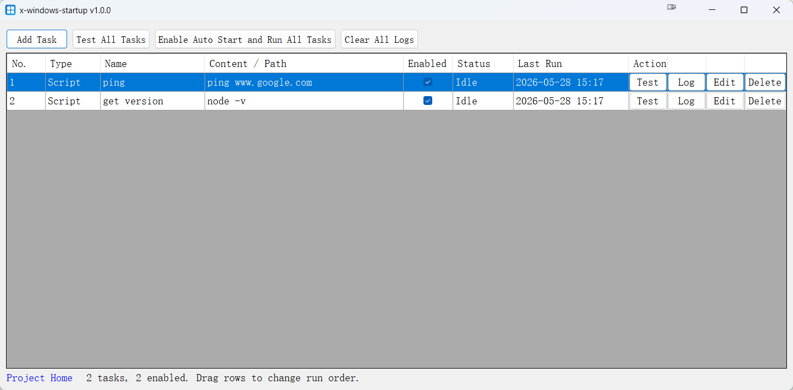

# x-windows-startup

x-windows-startup is a small Windows desktop utility for managing startup tasks.
It can run PowerShell scripts or launch program files with arguments, either manually for testing or automatically when the current Windows user signs in.

This project was generated entirely by AI and has not gone through very strict testing. In general it should work normally because it is a small utility, but please review and test it in your own environment before relying on it.

## Preview

## Download
[download](./release-builds/)

## Features

- Add multiple startup tasks.
- Supports two task types:
  - Script: enter PowerShell script content directly.
  - Program: select or enter a program path and optional arguments.
- Enable or disable each task.
- Drag rows to change the run order.
- Test a single task or test all tasks.
- Show each task's running status.
- Capture stdout/stderr output into per-task log files.
- Open a task's log from the task table.
- Clear all log files.
- Enable auto start for the current Windows user and run all enabled tasks at sign-in.

## Data Files

The application stores its data next to the executable:

- `tasks.json`: task configuration.
- `logs/{task-guid}.txt`: one log file per task.

Each task has a GUID as its unique key. Existing tasks without an ID are assigned one automatically when loaded.

## Auto Start

Auto start uses the current user's registry Run entry:

Registry key:

`HKEY_CURRENT_USER\Software\Microsoft\Windows\CurrentVersion\Run`

Value name:

`x-windows-startup`

This does not require administrator permissions and only affects the current Windows user.

Important: this application is not a Windows Service. It is a normal desktop application. When auto start is enabled, Windows launches it after the user signs in, just like other regular startup apps. It runs in the signed-in user's interactive desktop session, not in Session 0.

## Requirements

- Windows
- .NET Framework 4.7

